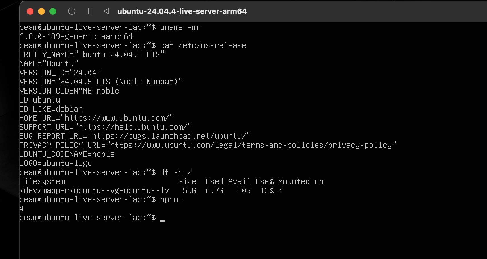
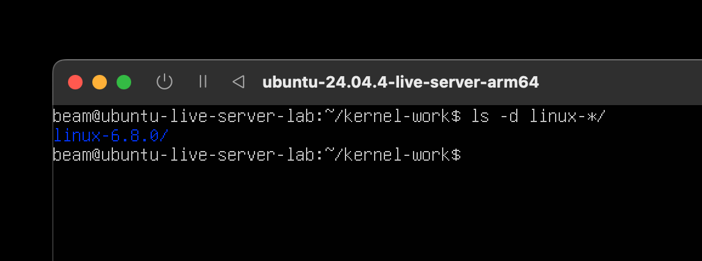

# Journey: preparing Ubuntu for the custom kernel

## 1. Updating the installed system

After installing Ubuntu Server, the base system was updated before starting the custom-kernel work. The VM was rebooted after the update and the environment was checked again.



The check showed:

```text
Ubuntu 24.04.5 LTS (Noble Numbat)
Kernel: 6.8.0-139-generic
Architecture: aarch64
Root filesystem: 59G total, 50G available
CPU cores: 4
```

The kernel shown above is still the stock Ubuntu kernel. The custom kernel has not been built yet.

## 2. Enable Ubuntu source repositories

All commands in this chapter run inside the Ubuntu VM terminal.

Open the Ubuntu repository configuration:

```bash
sudo nano /etc/apt/sources.list.d/ubuntu.sources
```

For every repository entry whose first line is:

```text
Types: deb
```

change it to:

```text
Types: deb deb-src
```

Keep the ARM64 repository URL unchanged. It should use the Ubuntu ports mirror:

```text
http://ports.ubuntu.com/ubuntu-ports
```

Save in nano with `Ctrl+O`, press Enter, then exit with `Ctrl+X`.

Refresh the package lists:

```bash
sudo apt update
```

## 3. Install kernel build dependencies

Install the dependencies specified by the project guide:

```bash
sudo apt build-dep -y linux linux-image-unsigned-$(uname -r)
sudo apt install -y fakeroot llvm libncurses-dev dwarves
```

If APT reports that no source package is available, check that every relevant `Types:` line contains `deb-src`, run `sudo apt update` again, and retry.

## 4. Download the matching Ubuntu kernel source

Create a separate workspace and download the source package matching the running kernel:

```bash
mkdir -p ~/kernel-work
cd ~/kernel-work
apt source linux-image-unsigned-$(uname -r)
ls -d linux-*/
```

The source package was downloaded successfully. The extracted source directory is:

```text
linux-6.8.0/
```



Enter the directory printed by the final command:

```bash
cd linux-*/
```

The full preparation, ABI change, build, installation, and verification procedure is in:

```text
../how-to-build-an-ubuntu-linux-kernel.md
```

## 5. Preparation completed

The source preparation checkpoint was completed. The source directory is ready for ABI modification and compilation.

Continue with:

- [Building the custom Ubuntu kernel](04-kernel-build-and-packages.md)
- [Installing and verifying the custom Ubuntu kernel](05-kernel-installation-and-verification.md)
