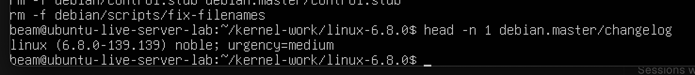
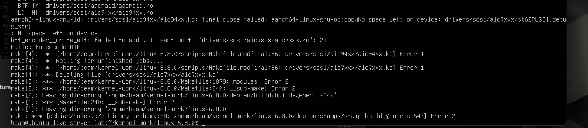
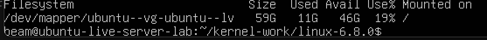
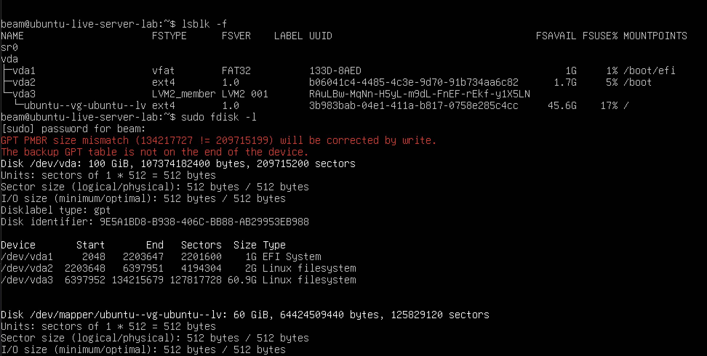
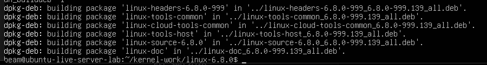
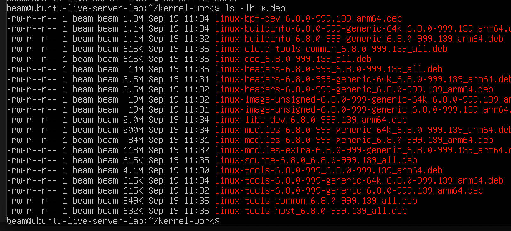

# Journey: building the custom Ubuntu kernel

## Goal

The goal of this phase was to compile the Ubuntu kernel source downloaded in the previous chapter and produce installable Debian packages for the ARM64 VM.

The build started from the stock Ubuntu kernel:

```text
6.8.0-139-generic
```

Only the Ubuntu ABI number was changed. No kernel configuration, source patch, or firmware change was added.

## 1. Preparing the source tree

The source was extracted at:

```text
/home/beam/kernel-work/linux-6.8.0/
```

The build scripts were made executable and the source tree was cleaned before compilation:

```bash
cd ~/kernel-work/linux-6.8.0

chmod a+x debian/scripts/*
chmod a+x debian/scripts/misc/*
fakeroot debian/rules clean
```

## 2. Changing the kernel ABI number

The first changelog entry originally identified the stock Ubuntu build:

```text
linux (6.8.0-139.139) noble; urgency=medium
```



The first ABI number was changed from `139` to `999`. The Ubuntu series and the remaining version field were preserved:

```text
linux (6.8.0-999.139) noble; urgency=medium
```

This separates the development kernel from the installed Canonical kernel while preserving the Ubuntu Noble package metadata.

## 3. First build attempt and disk-space problem

The kernel was built with the Ubuntu packaging rules:

```bash
fakeroot debian/rules clean
fakeroot debian/rules binary
```

The first build did not finish. The linker reported:

```text
No space left on device
```

The failure happened while writing ARM64 kernel modules. No custom kernel was installed from this failed attempt.



After the failed build was cleaned, the root filesystem showed approximately 46 GB available:

```text
Filesystem                                      Size  Used  Avail  Use%  Mounted on
/dev/mapper/ubuntu--vg-ubuntu--lv               59G   10G    46G   19%  /
```



## 4. Expanding the VM storage

The original UTM virtual disk was 64 GB. The virtual disk was expanded to 100 GiB in UTM. After booting Ubuntu, the disk had grown, but the LVM partition still ended at its original boundary:

```text
Disk /dev/vda: 100 GiB
/dev/vda3 ... 60.9G  Linux filesystem
```

The root filesystem was located in the LVM logical volume:

```text
/dev/mapper/ubuntu--vg-ubuntu--lv
```



The partition, physical volume, logical volume, and ext4 filesystem were expanded in that order:

```bash
sudo apt install -y cloud-guest-utils

sudo growpart /dev/vda 3
sudo pvresize /dev/vda3
sudo lvextend -l +100%FREE -r /dev/mapper/ubuntu--vg-ubuntu--lv

df -h /
```

The `growpart` command also corrected the GPT backup-table location after the virtual disk was enlarged.

## 5. Successful kernel build

After expanding the storage, the source tree was cleaned and the build was repeated:

```bash
cd ~/kernel-work/linux-6.8.0
fakeroot debian/rules clean
fakeroot debian/rules binary
```

The build completed and returned to the shell prompt without a build error.



The generated packages were written to the parent directory:

```bash
cd ~/kernel-work
ls -lh *.deb
```

The package list included the custom version `6.8.0-999.139` and ARM64 packages such as:

```text
linux-headers-6.8.0-999_6.8.0-999.139_all.deb
linux-headers-6.8.0-999-generic_6.8.0-999.139_arm64.deb
linux-image-unsigned-6.8.0-999-generic_6.8.0-999.139_arm64.deb
linux-modules-6.8.0-999-generic_6.8.0-999.139_arm64.deb
```

The build also produced packages for the `generic-64k` flavor. The next chapter installs the `generic` packages because the VM originally booted the `generic` kernel flavor.



## Result

The custom Ubuntu ARM64 kernel was compiled successfully. The generated packages are ready for installation and reboot testing.

Next: [installing and verifying the custom kernel](05-kernel-installation-and-verification.md).
