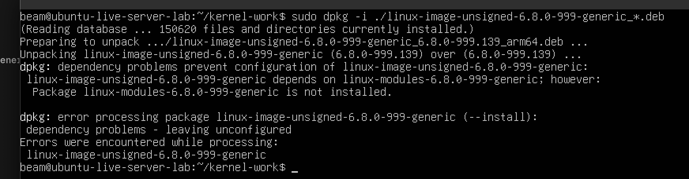
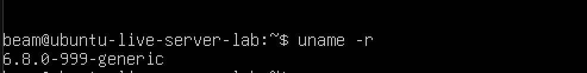

# Journey: installing and verifying the custom Ubuntu kernel

## Goal

This phase installed the kernel packages produced in the previous chapter, rebooted the ARM64 Ubuntu VM, and confirmed that the VM booted the custom kernel.

The stock kernel remained installed so it could be selected from GRUB if the custom kernel failed to boot.

## 1. Selecting the packages

The build produced packages for two ARM64 kernel flavors:

- `generic`
- `generic-64k`

The VM originally ran `6.8.0-139-generic`, so only the `generic` packages for version `6.8.0-999` were installed. The filename pattern included an underscore after `generic` so that it did not also match `generic-64k`.

Before installation, the VM should be protected with a UTM snapshot or duplicate. This preserves a rollback point in addition to keeping the stock kernel installed.

## 2. Installing the Debian packages

The packages were installed from the directory above the source tree:

```bash
cd ~/kernel-work

sudo dpkg -i ./linux-headers-6.8.0-999_*.deb
sudo dpkg -i ./linux-headers-6.8.0-999-generic_*.deb
sudo dpkg -i ./linux-image-unsigned-6.8.0-999-generic_*.deb
sudo dpkg -i ./linux-modules-6.8.0-999-generic_*.deb
```

The first image-package attempt occurred before the modules package was configured. `dpkg` therefore reported this dependency message:

```text
linux-image-unsigned-6.8.0-999-generic depends on linux-modules-6.8.0-999-generic;
Package linux-modules-6.8.0-999-generic is not installed.
```



This was a package-order issue, not a kernel-build failure. The missing modules package was installed, then pending packages were configured and GRUB was refreshed:

```bash
sudo dpkg -i ./linux-modules-6.8.0-999-generic_*.deb
sudo dpkg --configure -a
sudo update-grub
```

## 3. Rebooting into the custom kernel

The VM was rebooted after the package installation completed:

```bash
sudo reboot
```

Ubuntu booted successfully from the virtual disk.

## 4. Verifying the running kernel

The running kernel version was checked with:

```bash
uname -r
```

The result was:

```text
6.8.0-999-generic
```



This result confirms that the VM booted the newly built kernel rather than the original stock kernel.

## 5. Before-and-after comparison

| Check | Before build | After installation and reboot |
| --- | --- | --- |
| Kernel version | `6.8.0-139-generic` | `6.8.0-999-generic` |
| Architecture | `aarch64` | `aarch64` |
| Ubuntu release | Ubuntu 24.04.5 LTS | Ubuntu 24.04.5 LTS |
| Kernel source | Not custom-built | `linux-6.8.0` source tree |
| ABI number | `139` | `999` |

The stock `6.8.0-139-generic` kernel remains installed as the fallback option in GRUB's advanced boot menu.

## Result

The mini-project objective was completed:

1. Ubuntu kernel source was downloaded.
2. The ABI number was changed to `999`.
3. The ARM64 kernel packages were compiled.
4. The custom packages were installed in the VM.
5. The VM rebooted successfully.
6. `uname -r` confirmed `6.8.0-999-generic`.

The kernel build and installation report is complete when this chapter is submitted together with the earlier VM setup, Ubuntu installation, and build-preparation chapters.
