# Mini-Project 01 — Custom Ubuntu Kernel Evidence

This README explains the evidence collected while building and installing a
custom Ubuntu kernel in a QEMU/KVM guest. The PNG files are embedded below so
that the complete procedure can be reviewed from this directory.

## Environment

- Guest: Ubuntu 26.04.1 LTS (`resolute`)
- Virtualization: QEMU/KVM
- Architecture: `x86_64` / `amd64`
- Initial running kernel: `7.0.0-30-generic`
- Kernel source tree: `~/kernel-work/linux-7.0.0`
- Custom ABI: `999` with revision `.31`

The README is documentation; the PNG files are the image evidence.

## Step 0 — VM context

The following optional screenshots show the Ubuntu virtual machines in GNOME
Boxes and the Ubuntu desktop guest. They provide setup context only; the
terminal-based guest verification is the authoritative environment evidence.

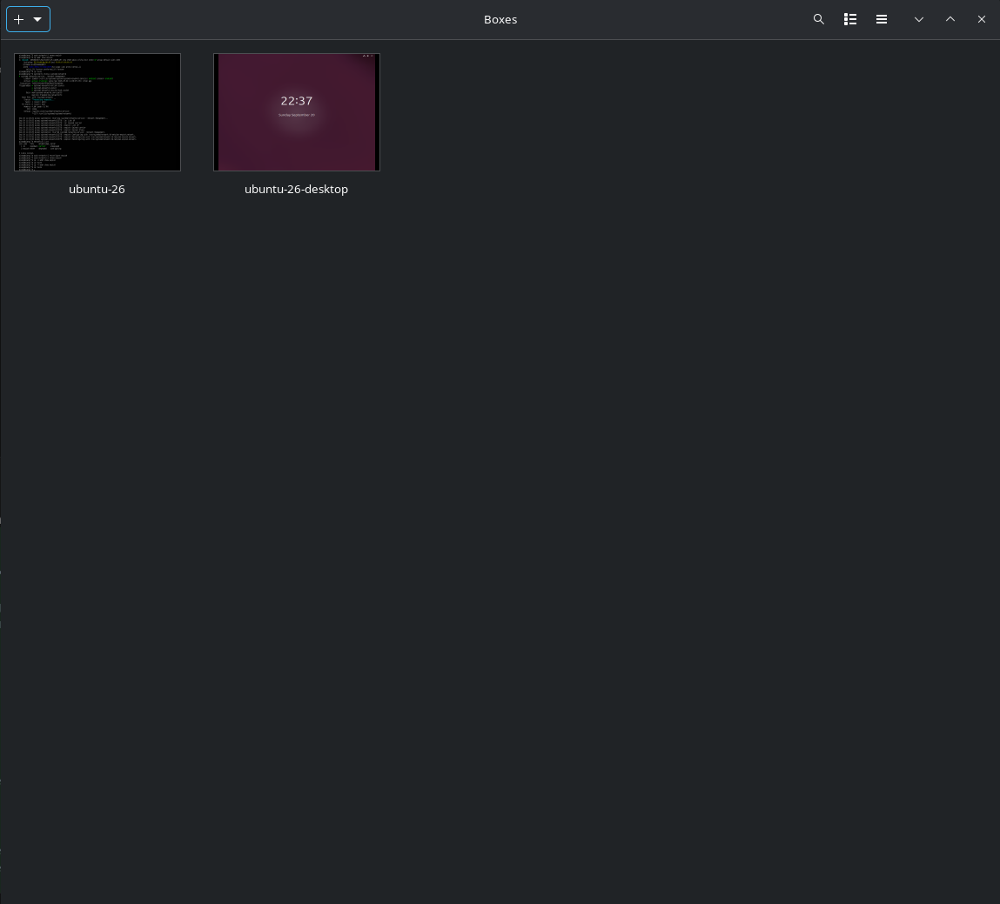

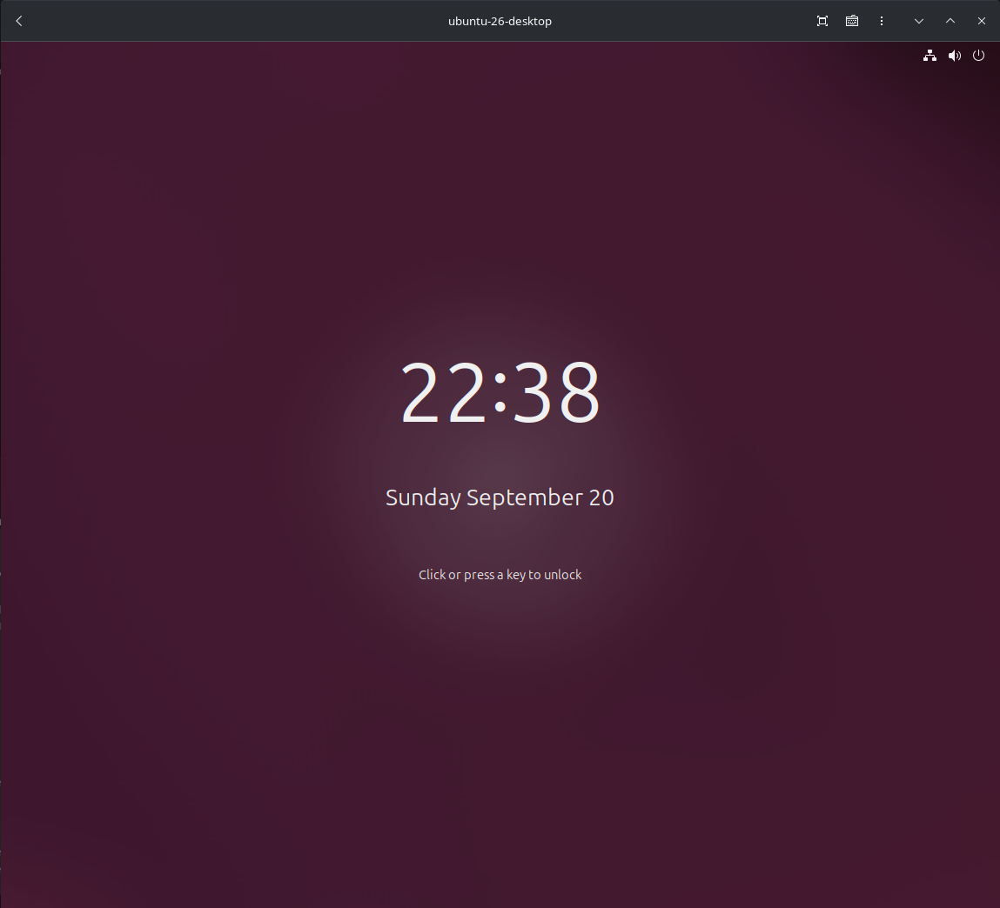

## Step 1 — Verify the QEMU/KVM guest

Inside the Ubuntu guest, record the operating system, virtualization method,
architecture, initial kernel, and available resources:

```bash
echo '=== Ubuntu guest ==='
cat /etc/os-release
echo '=== Virtualization ==='
systemd-detect-virt
echo '=== Initial kernel and architecture ==='
uname -a
uname -m
echo '=== Resources ==='
nproc
free -h
df -hT /
```

The screenshot shows Ubuntu 26.04.1 LTS, virtualization result `kvm`,
`x86_64`, kernel `7.0.0-30-generic`, 12 CPUs, 5.3 GiB RAM, and the root
filesystem.

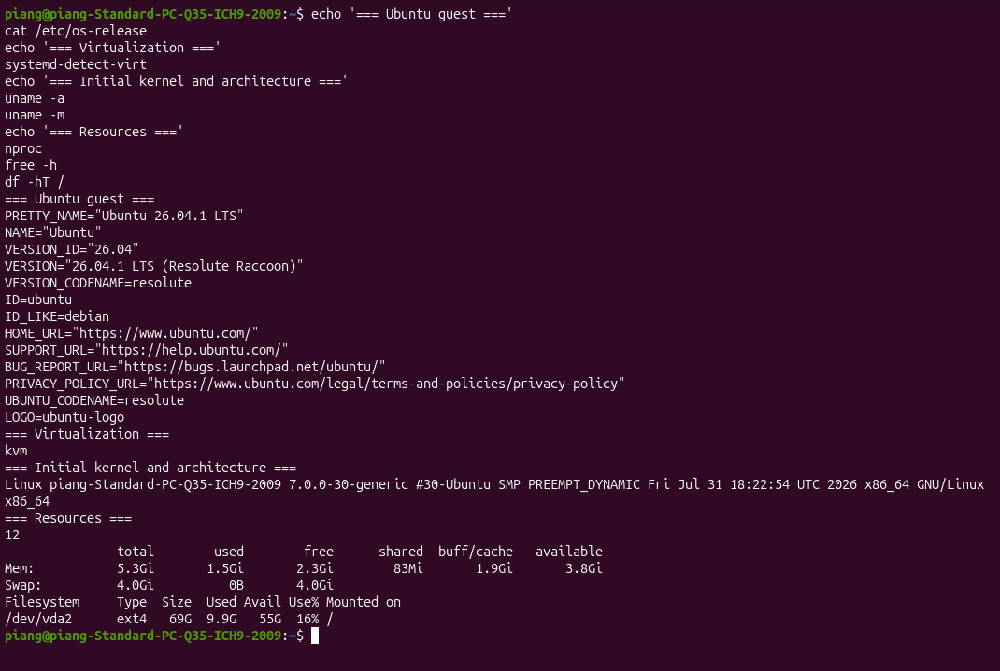

## Step 2 — Enable source repositories and install dependencies

Kernel source packages require source repositories. Inspect the active APT
configuration and install the build dependencies:

```bash
echo '=== Source repositories ==='
grep -RInE '^(Types:|URIs:|Suites:|Components:)' \
  /etc/apt/sources.list /etc/apt/sources.list.d 2>/dev/null

echo '=== Build dependencies ==='
sudo apt update
sudo apt build-dep -y linux "linux-image-unsigned-$(uname -r)"
sudo apt install -y fakeroot llvm libncurses-dev dwarves
```

The first attempt showed only `Types: deb`, so `apt build-dep` and `apt
source` reported that `deb-src` entries were missing. The active deb822 file
can be corrected with:

```bash
sudo sed -i 's/^Types: deb$/Types: deb deb-src/' \
  /etc/apt/sources.list.d/ubuntu.sources
sudo apt update
```

The backup file `ubuntu.sources.curtin.orig` is not the active configuration.

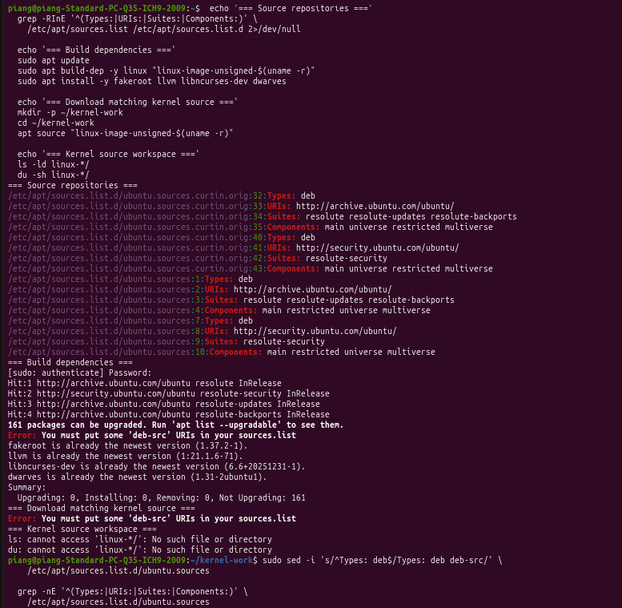

## Step 3 — Download and prepare the matching kernel source

Download the source package matching the running kernel and prepare the source
tree:

```bash
mkdir -p ~/kernel-work
cd ~/kernel-work
apt source "linux-image-unsigned-$(uname -r)"

echo '=== Kernel source workspace ==='
uname -r
ls -ld linux-*/
du -sh linux-*/

cd ~/kernel-work/linux-7.0.0
chmod a+x debian/scripts/* debian/scripts/misc/*
fakeroot debian/rules clean
```

The source tree was prepared at `~/kernel-work/linux-7.0.0`, and the clean
target completed successfully.

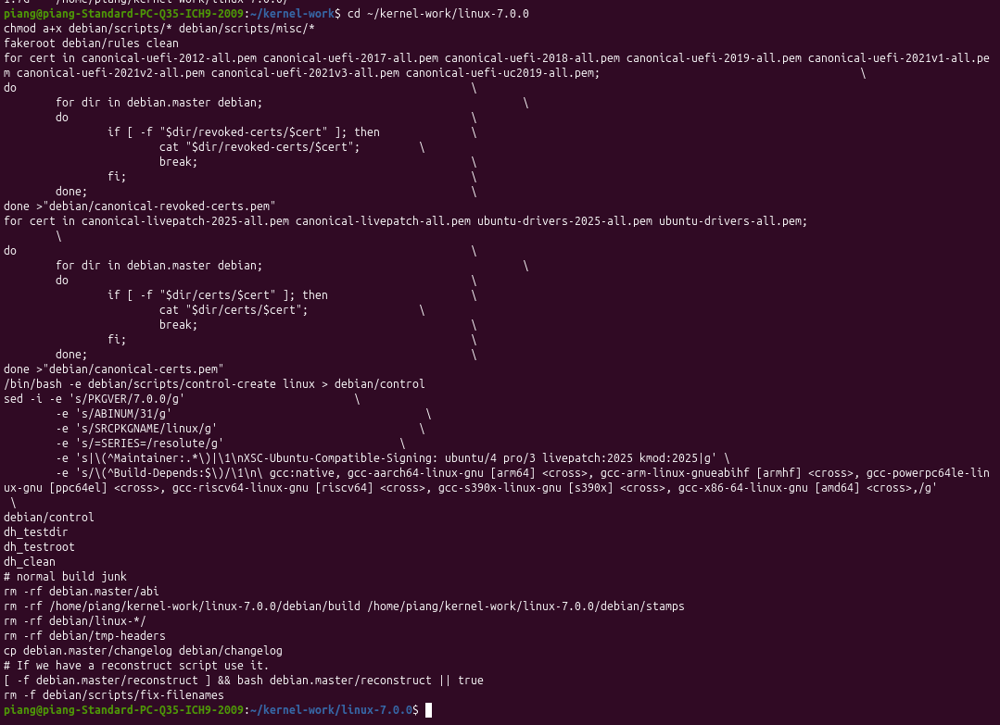

## Step 4 — Change the Ubuntu ABI number

Change only the ABI portion of the first changelog entry so the custom kernel
can coexist with the stock kernel:

```bash
cd ~/kernel-work/linux-7.0.0

echo '=== ABI before ==='
head -n 1 debian.master/changelog

sed -i '1s/-[0-9][0-9]*\./-999./' debian.master/changelog

echo '=== ABI after ==='
head -n 1 debian.master/changelog
```

The first entry changed from `7.0.0-31.31` to `7.0.0-999.31`; the Ubuntu
series (`resolute`) and revision (`.31`) were preserved.

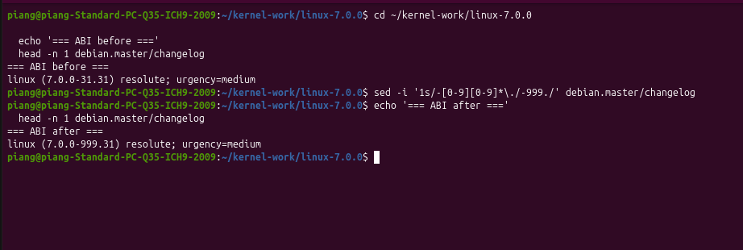

## Step 5 — Build the kernel packages

After changing the ABI, clean once more so the generated package metadata uses
ABI `999`, then build with two concurrent jobs:

```bash
cd ~/kernel-work/linux-7.0.0
df -hT /
fakeroot debian/rules clean
CONCURRENCY_LEVEL=2 fakeroot debian/rules binary
```

The build used about 22% of the 69 GiB root filesystem at the start and
progressed through header, tools, and package-generation stages.

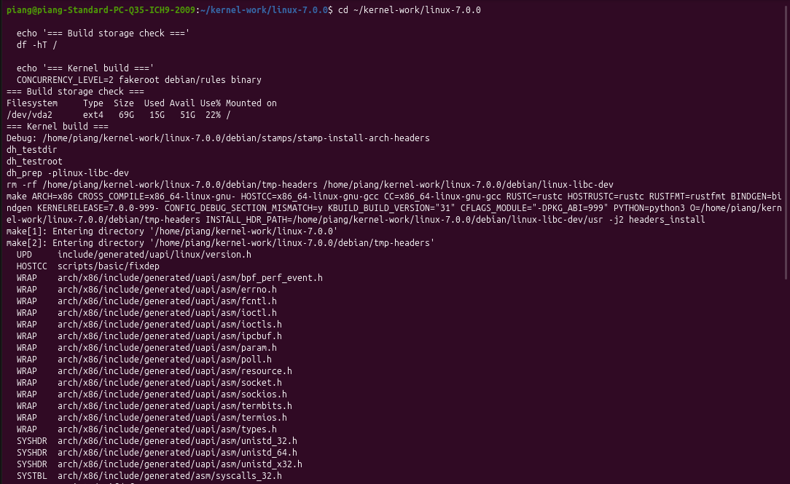

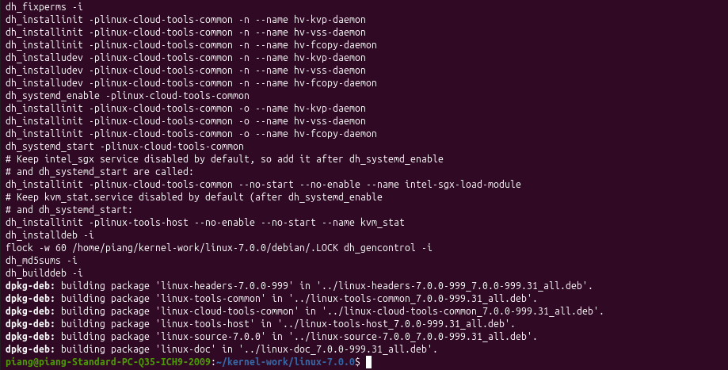

## Step 6 — Verify generated packages

After the build completes, inspect the packages in the parent directory:

```bash
cd ~/kernel-work
echo '=== Generated kernel packages ==='
ls -lh *.deb
```

The build produced `amd64` packages containing ABI `7.0.0-999.31`, including
the base headers, generic headers, unsigned image, and generic modules.

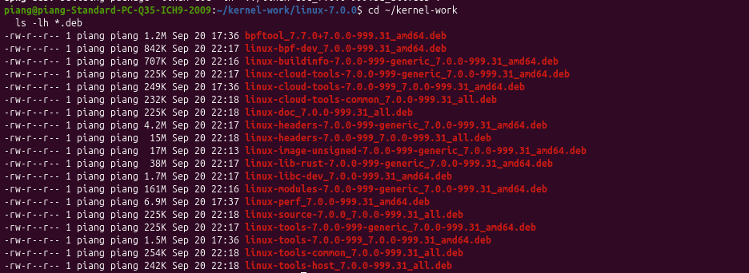

## Step 7 — Install the custom packages before reboot

Install the required packages together:

```bash
cd ~/kernel-work
sudo dpkg -i \
  ./linux-headers-7.0.0-999_*.deb \
  ./linux-headers-7.0.0-999-generic_*.deb \
  ./linux-image-unsigned-7.0.0-999-generic_*.deb \
  ./linux-modules-7.0.0-999-generic_*.deb
```

Then verify the package state, boot files, and GRUB entry:

```bash
dpkg -l | grep '999'
ls -lh /boot
grep -n '999' /boot/grub/grub.cfg 2>/dev/null
```

The captured installation reported a dependency on
`linux-main-modules-zfs-7.0.0-999-generic`, which was not available. As a
result, the custom image and modules packages remained unpacked but
unconfigured (`iU`). These screenshots preserve the real installation issue
and should be labelled as recovery/error evidence.

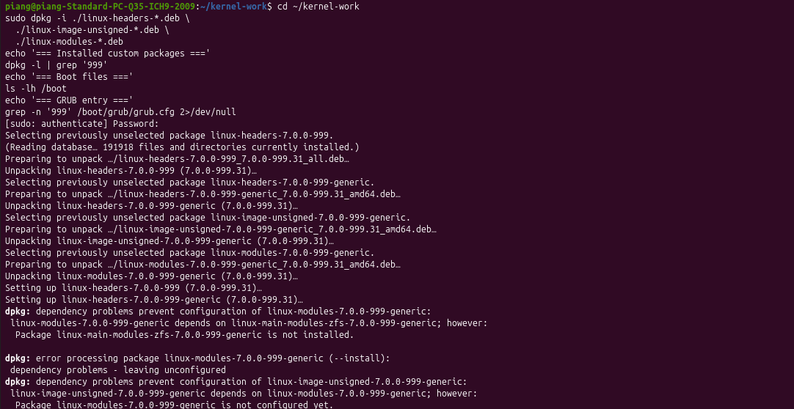

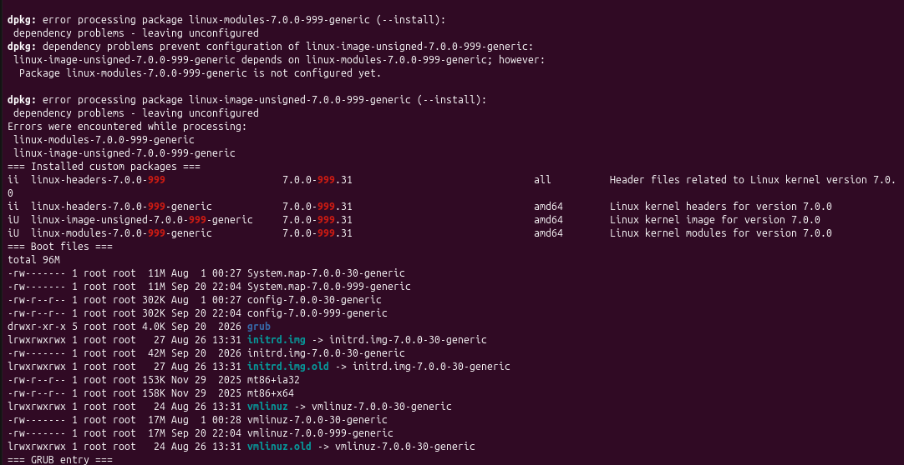

## Step 8 — Verify the custom kernel after reboot

Only reboot after the custom image and modules packages are fully configured
(`ii` in `dpkg -l`):

```bash
sudo update-grub
sudo reboot
```

After reboot:

```bash
echo '=== Running kernel ==='
uname -r
uname -a
echo '=== Custom packages ==='
dpkg -l | grep '999'
```

The captured result still reported `7.0.0-30-generic`, so the guest booted the
stock fallback kernel. It does not prove that the custom kernel booted.

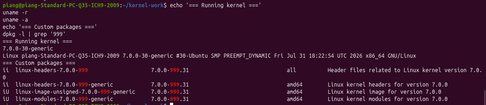

## Step 9 — Verify files for the running kernel

For a successful custom-kernel result, the following paths must contain
`7.0.0-999-generic`:

```bash
echo '=== Running kernel files ==='
ls -ld /lib/modules/$(uname -r)
ls -lh /boot/vmlinuz-$(uname -r) /boot/initrd.img-$(uname -r)
echo '=== Root filesystem ==='
df -hT /
```

The captured screenshot shows files for the stock `7.0.0-30-generic` kernel,
so it is final filesystem evidence for the fallback state, not proof of the
custom kernel installation.

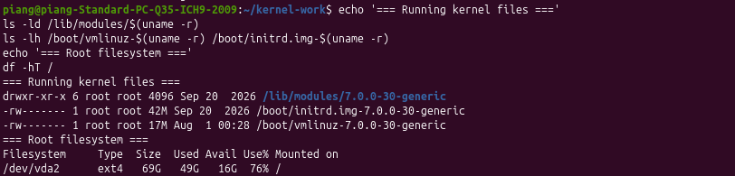

## Current result

The source preparation, ABI modification, kernel build, and package
generation were completed successfully. The installation and post-reboot
verification still require recovery from the unavailable custom-ABI ZFS
dependency. A fully successful final evidence set must show:

```text
uname -r                            -> 7.0.0-999-generic
dpkg -l | grep '999'                -> image/modules packages in state ii
/lib/modules/7.0.0-999-generic     -> present
/boot/vmlinuz-7.0.0-999-generic    -> present
/boot/initrd.img-7.0.0-999-generic -> present
```
